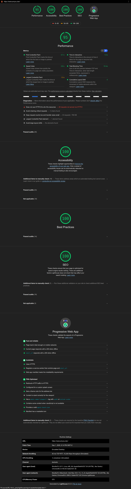

# Portfolio3wa

https://www.amyou.dev/ :

    Le front est en React.
    Le Back est en Node.
    Nodemailer pour le transport du formulaire de la rubrique Contact à ma boite Gmail.
    Les requêtes du formulaire de Contact sont gérés via Ajax.
    Côté Back j'utilise aussi les variables environnements de Heroku pour sécuriser  l'authentification de ma boîte mail personnelle mais aussi Helmet (pour un             setup un minimum sécurisé et pour une gestion de cookie), Express, BodyParser, Morgan, Compression etc...
    Côté Front j'ai implémenté un switch de mode Dark/light, gestion de scroll mais aussi de l'internalisation/Traduction avec I18n et du Json avec les trois différentes méthode pour expérimenter et prendre la main. Donc High order Component de React dans certains composant, UseTranslation avec React Hook, et finalement Trans Component. Je pouvais aussi utilisé le translation render prop mais je ne l'ai pas fait.
     Toujours côté Front oui il y'as une dizaine de composants mais c'est pour tout diviser pour la lisibilité et la "scalability" car je suis en train de rajouter une fonction/Page Blog au site et autres ...
    Aussi il y as une fonction de lazy loading avec Suspense et une "fallback" qui permet de gérer l'upload de la page et du Json/text de la Traduction Ang/Fr avec un composant loader avec une mini animation Scss qui est controler.
    Google Analytics est implémenté.
    Un Robot.txt est là pour des règles SEO.
    Le site est Responsive à 100%.
    les favicons sont customisés pour satisfaire un grand nombre d'appareil différents.
    PWA ready.
    La gestion de scroll est géré par son propre composant.
    Les composants qui gèrent le switch de mode sont pensés pour ajouter d'autres thèmes facilement à la demande.
    Un jeu Canvas en guise de page erreur 404.

Je laisse un dump SQL informatif ici sur cette repo j'éspére que ça vas pas confondre. il est au nom de user.sql est c'est le dump du projet symfony react exp

Audit lighthouse de google la seule raison pour laquelle je n'obtient pas 100% en performance étant le protocole HTTP/2 qui est disponible sur heroku mais très coûteux ^^ .

